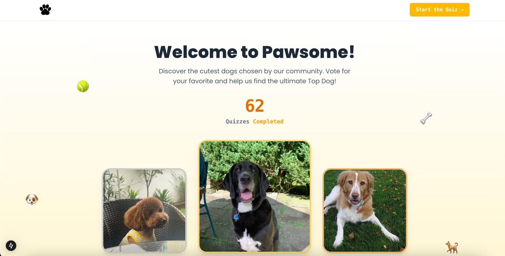

# 🐾 Pawsome - Dog Quiz App

**Pawsome** is a simple and fun quiz app built with **Next.js 14** and **TypeScript**. In this game, users choose the cutest dog between two random images. The quiz works like an elimination tournament — at the end, one winner remains!



## 🚀 Features

- 🎮 Interactive tournament-style quiz
- 🐶 Random dog images fetched from **[Dog API](https://dog.ceo/api)**
- 💾 Winner saved to local storage and backend
- 🔄 Option to reset the quiz
- 🌐 Loading and error handling
- 
## 🛠️ Tech Stack
- [Next.js 14 (App Router)](https://nextjs.org/)
- TypeScript
- React Hooks & Server Components
- Tailwind CSS
- Headless UI
- Dog API

## How to Run Locally ⚙️

1.  **Clone the Repository:**
    ```bash
    git clone [https://github.com/Puc3k/pawsome-next-js.git](https://github.com/Puc3k/pawsome-next-js.git)
    cd pawsome-next-js
    ```

2.  **Install Dependencies:**
    ```bash
    npm install
    # or
    yarn install
    # or
    pnpm install
    ```

3.  **Configure Environment Variables:**
   * Create a `.env.local` file in the root directory of the project.
   * Add any necessary environment variables, such as the backend API URL (if applicable).
       ```
       MONGODB_URI=your_mongo_db_here
       ```

4.  **Run the Development Server:**
    ```bash
    npm run dev
    # or
    yarn dev
    # or
    pnpm dev
    ```

    Open your browser and navigate to `http://localhost:3000`.

## Future Enhancements ✨
* **User Authentication:** Introduce a user registration and login system.
* **Dog Filtering and Sorting:** Allow users to filter and sort dogs based on various criteria.
* **More Animations and Effects:** Add subtle animations and visual effects to enhance the interface.
* **Unit and Integration Tests:** Write tests to ensure code stability and reliability.
* **Improved Error Handling:** Display more informative error messages to users.
* **SEO Optimization:** Enhance meta tags and other elements for search engine optimization.
* **Accessibility (A11y):** Ensure the website is accessible to all users, including those with disabilities.
* **Bot Protection:** Implement mechanisms to protect against spam and bots (e.g., reCAPTCHA).

### 🤝 Contributions
This is a personal project made for learning and fun.
Feel free to open an issue or submit a pull request if you want to improve it!